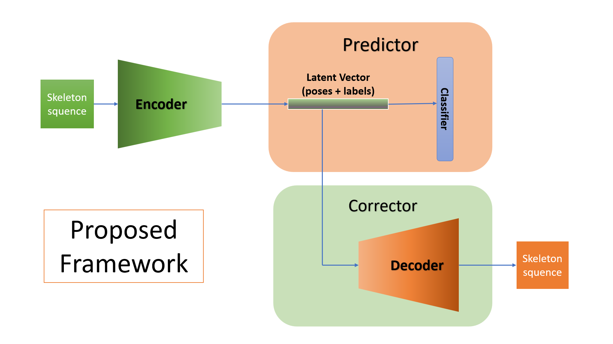

# Human Pose Correction for videos

This is the repo for our research project called Human Pose Correction for Videos. 

This is our proposed framework:



## To train Predictor

```
python main.py --half=False --batch_size=64 --test_batch_size=64 \
    --step 10 20 --num_epoch=30 --n_heads=3 --num_worker=4 --k=1 \
    --dataset=ec3d --num_class=3 --lambda_1=1e-4 --lambda_2=1e-1 --z_prior_gain=3 \
    --use_vel=False --datacase=EC3D --weight_decay=0.0005 \
    --num_person=1 --num_point=25 --graph=graph.ec3d.Graph --feeder=feeders.feeder_ec3d.Feeder
```
